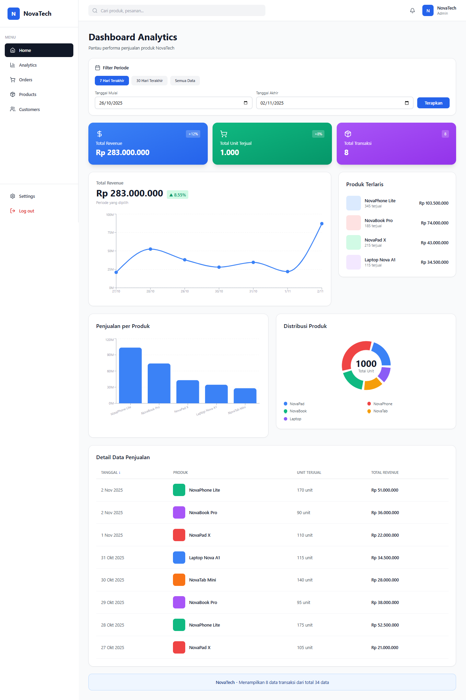

# NovaTech Dashboard Analytics
Dashboard analytics internal untuk startup fiktif **NovaTech** yang menampilkan visualisasi data penjualan produk secara real-time dengan fitur filtering dan sorting.

## Deskripsi Project
NovaTech Dashboard adalah aplikasi web berbasis React yang dirancang untuk membantu tim sales dan manajemen memantau performa penjualan produk. Dashboard ini menyediakan berbagai visualisasi data seperti line chart untuk tren revenue, bar chart untuk perbandingan produk, dan tabel interaktif dengan fitur sorting.

### Fitur Utama:
- ✅ **Line Chart** - Visualisasi tren revenue harian
- ✅ **Bar Chart** - Perbandingan penjualan antar produk
- ✅ **Pie Chart** - Distribusi penjualan produk
- ✅ **Filter Tanggal** - 3 preset (7 hari, 30 hari, semua) + custom range
- ✅ **Sorting Table** - Urutkan data berdasarkan tanggal, produk, sales, atau revenue
- ✅ **Responsive Design** - Tampilan optimal di mobile, tablet, dan desktop
- ✅ **Stats Cards** - Ringkasan total revenue, unit terjual, dan transaksi

## Tech Stack
- **Frontend Framework**: React.js 18.2.0
- **Build Tool**: Vite 5.0.8
- **Styling**: Tailwind CSS 3.3.6
- **Charts Library**: Recharts 2.10.3
- **Icons**: Lucide React 0.263.1
- **Language**: JavaScript (ES6+)
